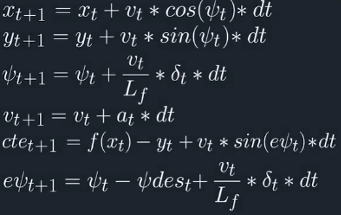
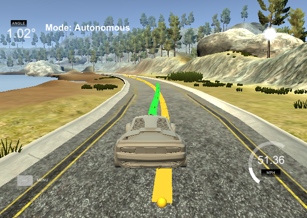

## Project Introduction

This project implemented a MPC controller for the vehicle control in a virtual environment in C++. 

## MPC controller

### Vehicle model

The kinematic model was used in this project, and the vehicle states included the coordinates (x, y), the orientation psi, the velocity v, the cross track error cte and the psi error epsi.

Vehicle states were updated from the previous states based on the following equations.

### MPC hyperparameters

Timestep length and N elapsed duration dt were set to 8 and 0.1 correspondingly. Larger timestep turned out to work badly due to weak adaptation to the changing environment.And if the elapsed duration was large, the vehicle would react slowly and run out of the lane.

### Waypoints fitting 

The waypoints were outputted from the map coordinates, this project converted them in to the vehicle coordinates for tracking convenience and better visualization.
After that, the waypoints were fitted into a 3 order polynomial model with parameters coeffs in the main.cpp.

### Latency

There were 100ms latency in this project, and was dealed with the vehicle model, where euqations were altered to let the actuation orders fitting the next timestep.

### Visualization

The referance trajectory which were fitted by waypoints was drawn in yellow, and the tracjectory produced by the MPC controllor was drawn in green, as is depicted in the following picture.

## Basic Build Instructions

1. mkdir build
2. cd build
3. cmake ..
4. make
5. ./mpc

